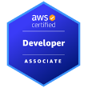
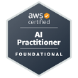

  

  <h1>Amar Mohite</h1>
  <h3>Software Engineer | Cloud, AI & Agentic Systems</h3>

  

    Full stack engineer with 3+ years of experience building production systems across AWS, AI workflows,
    and responsive web applications.
  

  

    <a href="https://github.com/amarmohite2001"><strong>GitHub Profile</strong></a>
    ·
    <a href="./public/resume/Amar_Gajanan_Mohite_Resume.pdf"><strong>Resume PDF</strong></a>
    ·
    <a href="https://amarmohite2001.github.io/amarmohite2001/"><strong>Portfolio Site</strong></a>
  

 

## Summary

I design and ship cloud-native products, AI-enabled workflows, and data-driven user experiences.
My work spans frontend engineering, backend services, AWS infrastructure, and agentic systems that
reduce manual effort and improve delivery speed.

## Resume Snapshot

| Area | Details |
| --- | --- |
| Experience | 3+ years in full stack engineering, cloud architecture, and AI systems |
| Current Role | Software Engineer 2, University of Phoenix |
| Specialties | AWS, React, Next.js, Terraform, LangChain, LangGraph, Docker, Kubernetes |
| Focus | Scalable product delivery, observability, automation, and clean UI implementation |

## Skills

**Languages & Frameworks**

  
  
  
  
  
  
  
  
  
  
  
  
  
  
  
  
  

**Cloud, Infrastructure & Databases**

  
  
  
  
  
  
  
  
  
  
  
  
  
  
  
  
  

## Experience

### Software Engineer 2, University of Phoenix
May 2024 - Present

- Sole-delivered the Student Academic Dashboard, consolidating 6+ data sources and reducing advisor research time by 80%.
- Designed the Knowledge Base RAG Chatbot on AWS with LangGraph and hybrid retrieval, reaching 97% retrieval accuracy.
- Built the Agentic Orchestration Engine and Salesforce Notes Summarizer with production guardrails and scalable delivery.
- Migrated 20+ event streams to Amazon MSK and orchestrated microservices with Step Functions.

### Project Coordinator, Arizona State University
Feb 2023 - Apr 2024

- Directed 30+ research and outreach events across 50+ stakeholder organizations.
- Maintained and improved the center website stack using MySQL, .NET Core, ReactJS, and SurveyJS.
- Improved website functionality and UX by 15% through iterative updates and issue resolution.

### Software Development Engineer Intern, Sairaj Telecom
Apr 2021 - Jun 2022

- Built an operations dashboard for accounting, service delivery, and data workflows.
- Improved frontend and backend usability while supporting AWS deployment workflows.

### Systems Engineer, Safear Defense
Jun 2020 - Mar 2021

- Analyzed and maintained 1M+ records, improving data accuracy and reducing maintenance overhead.

## AWS Certifications

<table>
  <tr>
    <td align="center" width="25%">
      <a href="https://www.credly.com/badges/95a4e0dd-3f8f-4e4e-b01d-dded44b187f8/public_url" target="_blank" rel="noopener noreferrer">
        
         
        Solutions Architect
      </a>
    </td>
    <td align="center" width="25%">
      <a href="https://www.credly.com/badges/04f5cccf-1cc2-444e-9c9f-fe9c49657c53/public_url" target="_blank" rel="noopener noreferrer">
        
         
        Cloud Practitioner
      </a>
    </td>
    <td align="center" width="25%">
      <a href="https://www.credly.com/badges/7ddbae52-1c05-401c-bc57-cc0a177d5dea/public_url" target="_blank" rel="noopener noreferrer">
        
         
        Developer Associate
      </a>
    </td>
    <td align="center" width="25%">
      <a href="https://www.credly.com/badges/b41a1b7c-8182-4e31-a27e-425d0e171543/public_url" target="_blank" rel="noopener noreferrer">
        
         
        AI Practitioner
      </a>
    </td>
  </tr>
</table>

## Featured Projects

<table>
  <tr>
    <td width="50%"><strong>Student Academic Dashboard</strong> AI-assisted academic insights dashboard with multi-source data consolidation.</td>
    <td width="50%"><strong>Knowledge Base RAG Chatbot</strong> AWS-based retrieval app with LangGraph, Qdrant, and OpenSearch.</td>
  </tr>
  <tr>
    <td width="50%"><strong>Agentic Orchestration Engine</strong> Workflow engine for advisor-facing automation and next-best-action delivery.</td>
    <td width="50%"><strong>Salesforce Notes Summarizer</strong> Large-scale summarization pipeline with guardrails and PII protection.</td>
  </tr>
</table>

## Contact

- Location: Tempe, AZ, United States
- Phone: [602-422-4344](tel:6024224344)
- Email: [amarmohite200@gmail.com](mailto:amarmohite200@gmail.com)
- LinkedIn: https://www.linkedin.com/in/amarmohite2001
- GitHub: https://github.com/amarmohite2001
